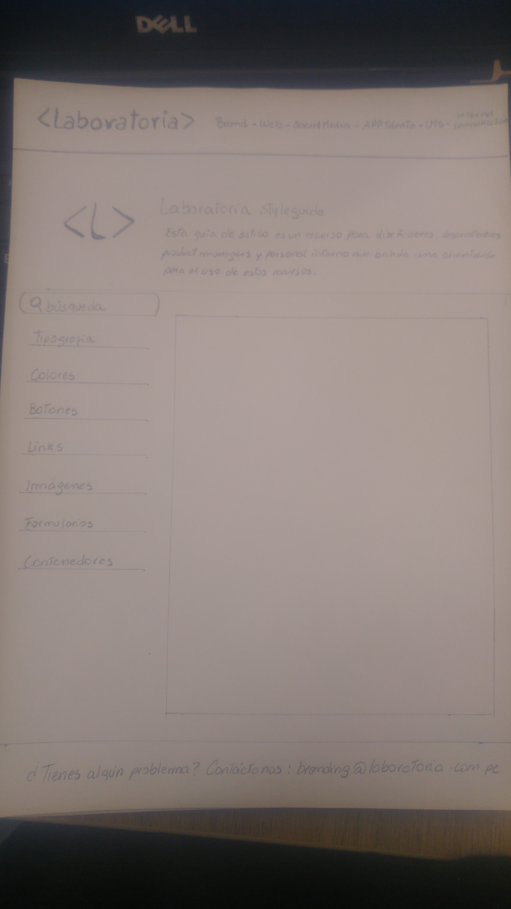
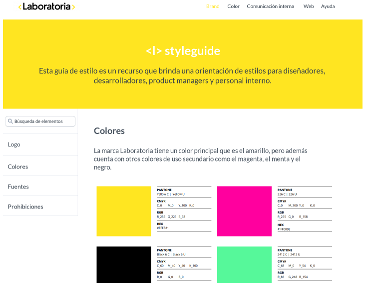

#

# StyleGuide

Es una plataforma digital que facilita al usuario el uso de las guías de estilo de Laboratoria, esencial para fortalecer la marca.

### Desarrollado para

- [Laboratoria](http://laboratoria.la)

### Objetivo

- Permitir de la forma más eficaz definir las bases y normas de comunicación dentro de Laboratoria, de manera coherente, auténtico y manteniendo continuidad a través de todos los medios digitales (y no digitales) desde el formato escrito, la voz, la imagen de marca es un propósito prioritario para Laboratoria.

### Utilidad

- Esta guía será útil para las personas que laboran en Laboratoria, desde creadores de contenido internos, diseñadores, desarrolladores, etc.

#

## DISEÑO CENTRADO EN EL USUARIO

### DIA 1

### DESCUBRIMIENTO E INVESTIGACIÓN

#### 1.- Planeamiento

Presentación y conversaciones en el squad para poder analizar cuáles serían las metodologías a usar para el reto asignado.

#### 2.- Research cualitativo

Se realizó un **diagrama de Afinidad** con la finalidad de poder analizar las propuestas de preguntas de cada una y no repetirlas durante la entrevista. Concretando la [guía de entrevista](https://docs.google.com/document/d/1MLC8BdoegsvjA-xcX3hwHy_L7PowZzVmqTB6AMST17k/edit#)

Se realizaron 2 entrevistas:

- Mery, desarrolladora del equipo de Laboratoria
- Begonia, diseñadora del equipo de Laboratoria

Ya con los datos comparados, el equipo procede a contactarse con otros usuarios más cercanos, con la finalidad de realizar preguntas más directas para una segunda entrevista.

#### 3.- Benchmark

Se realiza la diferenciación con las diferentes páginas de las empresas, que ofrecen guías de estilo.
- [Yelp](https://www.yelp.com/styleguide)
- [Buffer](https://buffer.com/style-guide)
- [bootstrap](https://getbootstrap.com/)

### DIA 2

### SINTESIS Y DEFINICIÓN

#### 1.- Affinity Mapping

Con las información recabada se comenzó a trabajar el **Affinity Mapping** donde se agruparon las áreas de trabajo de Laboratoria.

Se agruparon según las inquietudes de los usuarios en las siguientes categorías :

- Brand
- Color
- Comunicación Interna
- Web
- Ayuda

#### 2.- User Persona

Con la información recaudada de las entrevistas, se define nuestro User Persona.

#### 3.- Problem Statement

Usamos el siguiente patrón para definir un problema.

#### 4.- How Might We? (HMW)

Herramienta utilizada para empezar a generar soluciones.

#### 5.- What if? (HMW)

Herramienta necesaria para consolidar la solución.

#### 6. Feature List

Se definió las funcionalidades del reto, según las siguientes categorías:

- Brand
- Color
- Comunicación Interna
- Web
- Ayuda

#### MVP

Nuestro producto mínimo viable debe contener lo siguiente:

- Tener una sección del branding de Laboratoria.
- Que pueda realizar la visualización de las herramientas dentro de la empresa, comunicación interna.
- Que muestre tutoriales de diferentes aspectos, por parte de la diseñadora de Laboratoria.
- Que muestre los componentes, con los códigos necesarios, para el uso por parte de las desarrolladoras.

Este mínimo producto viable se realizó debido a que representa lo esencial y es de bajo costo realizarlo.

### IDEACIÓN 

### PROTOTIPO

#### 1.- Paper prototype

Con nuestro MVP definido, se procede a realizar el prototipo.

#### 2.- Prototype de alta fidelidad

Se utilizaron las herramientas de marvel y figma.

[prototype](https://marvelapp.com/86i06bb/screen/40355827)

#### Testing

Se realizaron diferentes testing con el objetivo de mejorar el proceso.

#### Demo

Con el proceso respectivo se desarrolló el demo del producto.

[demo](https://github.com/Rocciescobar/react-fancy-component)

### **Equipo de Trabajo**

>##### L. Vanessa Colqui Santos
>##### Rocci Escobar Nuñez
>##### Lourdes Lissete Loayza Mesías
>##### Melissa Yauri Machaca